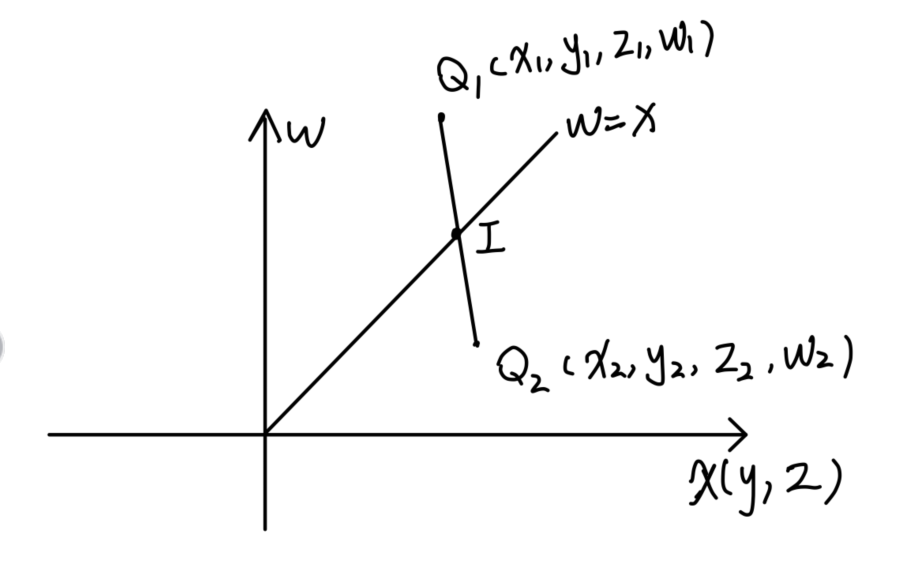

## 1. 模型矩阵（Model Matrix）

### 1.1 平移矩阵
$$
   Model_{Matrix} = 
   \begin{bmatrix} 
   1 & 0 & 0 & \text{t}_x \\
   0 & 1 & 0 & \text{t}_y \\
   0 & 0 & 1 & \text{t}_z \\
   0 & 0 & 0 & 1
   \end{bmatrix}
$$
### 1.2 缩放矩阵
$$
   Model_{Matrix} = 
   \begin{bmatrix} 
   \text{s}_x & 0 & 0 & 0 \\
   0 & \text{s}_y & 0 & 0 \\
   0 & 0 & \text{s}_z & 0 \\
   0 & 0 & 0 & 1
   \end{bmatrix}
$$
### 1.3 旋转矩阵

#### 三维空间绕 x 轴旋转矩阵
绕 x 轴旋转的旋转矩阵如下：

$$
\begin{bmatrix}
1 & 0 & 0 \\
0 & \cos(\theta) & -\sin(\theta) \\
0 & \sin(\theta) & \cos(\theta) \\
\end{bmatrix}
$$

#### 三维空间绕 y 轴旋转矩阵
绕 y 轴旋转的旋转矩阵如下：

$$
\begin{bmatrix}
\cos(\theta) & 0 & \sin(\theta) \\
0 & 1 & 0 \\
-\sin(\theta) & 0 & \cos(\theta) \\
\end{bmatrix}
$$

#### 三维空间绕 z 轴旋转矩阵
绕 z 轴旋转的旋转矩阵如下：

$$
\begin{bmatrix}
\cos(\theta) & -\sin(\theta) & 0 \\
\sin(\theta) & \cos(\theta) & 0 \\
0 & 0 & 1 \\
\end{bmatrix}
$$

这些矩阵可以用于将点或物体绕着特定的轴进行旋转。同样地，在矩阵乘法中，旋转矩阵通常作为左乘矩阵，用于将旋转操作应用于向量或其他变换矩阵上。

## 2. 观察矩阵（View Matrix）
   观察矩阵描述了观察者（一般是相机）的位置和方向，以及观察者的视角。它通常是观察者的逆变换，将世界坐标系中的物体转换到观察者的视角。一般形式如下：
   
$$
   View_{Matrix} = 
   \begin{bmatrix} 
   \text{right}_x & \text{up}_x & \text{forward}_x & -\text{position}_x \\
   \text{right}_y & \text{up}_y & \text{forward}_y & -\text{position}_y \\
   \text{right}_z & \text{up}_z & \text{forward}_z & -\text{position}_z \\
   0 & 0 & 0 & 1
   \end{bmatrix}
$$

## 3. 投影矩阵（Projection Matrix）
   投影矩阵用于将三维空间投影到二维屏幕上。这里给出透视投影和正交投影两种形式的投影矩阵。

   - **透视投影矩阵（Perspective Projection Matrix）**：
   
$$
   Perspective_{Matrix} = 
   \begin{bmatrix} 
   \frac{2n}{r-l} & 0 & \frac{r+l}{r-l} & 0 \\
   0 & \frac{2n}{t-b} & \frac{t+b}{t-b} & 0 \\
   0 & 0 & -\frac{f+n}{f-n} & -\frac{2fn}{f-n} \\
   0 & 0 & -1 & 0
   \end{bmatrix}
$$

   其中，\(l\)、\(r\)、\(t\)、\(b\) 分别表示视景体的左、右、上、下面，\(n\) 和 \(f\) 分别表示视景体的近裁剪面和远裁剪面。

   - **正交投影矩阵（Orthographic Projection Matrix）**：
   
$$
   Orthographic_{Matrix} = 
   \begin{bmatrix} 
   \frac{2}{r-l} & 0 & 0 & -\frac{r+l}{r-l} \\
   0 & \frac{2}{t-b} & 0 & -\frac{t+b}{t-b} \\
   0 & 0 & -\frac{2}{f-n} & -\frac{f+n}{f-n} \\
   0 & 0 & 0 & 1
   \end{bmatrix}
$$

   其中，\(l\)、\(r\)、\(t\)、\(b\)、\(n\)、\(f\) 同样表示视景体的边界和裁剪面的位置。

这些矩阵是基本的表示形式，实际应用中可能会根据具体情况进行调整和优化。

旋转矩阵用于描述在二维或三维空间中执行旋转操作的矩阵。以下是二维和三维空间中常见的旋转矩阵表示：
## 4.裁剪空间

$$
\begin{aligned}
&Q_1(x_1,y_1,z_1,w_1)\\
&I(x_i,y_i,z_i,w_i)\\
&Q_2(x_2,y_2,z_2,w_2)\\

&I= Q_1+t(Q_2-Q1)\\
&w=x:\\
&w_1+t(w_2-w_1)=x_1+t(x_2-x_1)\\
&t=\frac{w_1-x_1}{(w_1-x_1)-(w_2-x_2)}\\

&w=-x:\\
&t=\frac{w_1+x_1}{(w_1+x_1)-(w_2+x_2)}\\
\end{aligned}
$$