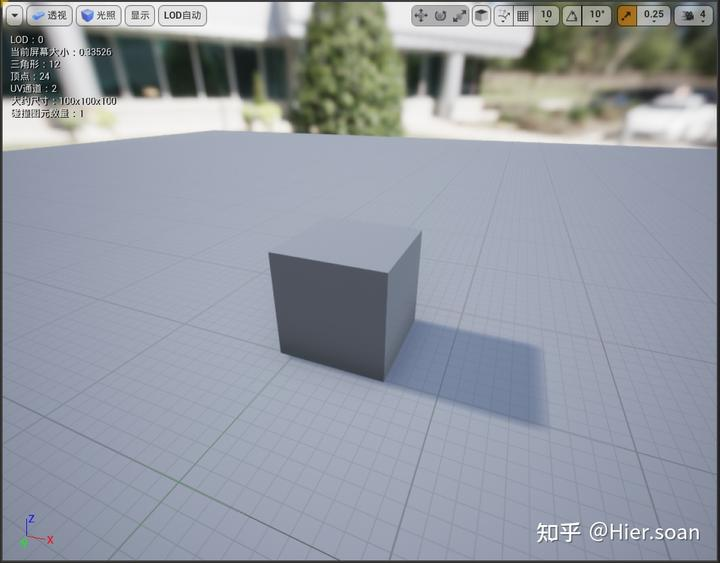
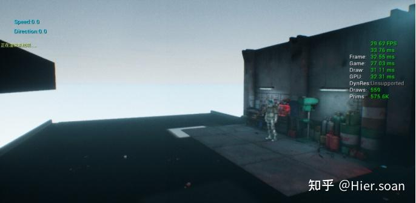

图形学：MVP变换概述

https://zhuanlan.zhihu.com/p/551648397
===========

MVP变换，就是**M**odel模型、**V**iew观察、**P**rojection投影变换三个单词的缩写。是图形学中将三维空间的物体呈现在二维屏幕上十分重要的三个变换。在学习MVP变换之前，首先要知道几个空间的概念。

五个空间及三个变换
---------

### **1\. 局部空间 Local Space**

假设这样一个情景：在一个游戏场景空间中，有一个坐标原点。场景中的每一个物体，都相对于这个原点有自己的坐标。例如下图中标定的盒体在场景中的坐标为 （，，）（100，100，50）（100，100，50）（100，100，50） 。我们知道渲染一个盒体需要给顶点着色器传入顶点坐标，那渲染这个盒体，就要通过相对坐标 （，，）（100，100，50）（100，100，50）（100，100，50） 的计算把周围8个顶点坐标的位置都算出来，然后再传入顶点着色器，就能渲染出在场景中处于某个位置的盒体。如下图所示的另外三个顶点的坐标：

场景中的盒体

一个盒体这么算一下还好，要是场景中的物体很多，又是不规则模型，要是再移动一下盒体的位置，则盒体上所有的顶点坐标又要重新进行计算，重新计算顶点坐标这个过程不是最可怕的，最可怕的是顶点坐标会随着模型的运动而变换，这样一来存储顶点数据的缓冲就要在每一次变换时重新向GPU发送数据，性能开销极大。因此为何不先相对于 （，，）（0，0，0）（0，0，0）（0，0，0） 进行盒体的渲染，然后在通过变换把盒体再移到指定的坐标呢？

将模型起始于原点位置进行顶点的设置，所有的顶点坐标都是相对于 （，，）（0，0，0）（0，0，0）（0，0，0） ，简洁明了。想要移动模型时，我们无需改变已经在缓冲区的顶点坐标数据，只需考虑如何通过一个变换，将模型移到我们指定的位置。而**变换，一般都是将坐标与矩阵做乘积**，因此，通过这种办法去处理模型的顶点问题，既省去了相对模型坐标的顶点的计算问题，又能保证在模型进行移动等各种变换时，只改变矩阵的形式，而不改变已经缓存的顶点坐标。这个变换矩阵也就是MVP变换中的Model变换。

这种**以原点** （，，）（0，0，0）（0，0，0）（0，0，0） **为模型起始点的空间，就称为局部空间**。如下图所示，就是UE中表示一个模型局部空间的方式。很直观的看到，这个局部空间，盒体就是“主角”。我们可以在局部空间内进行一切只针对模型本身特征的渲染，如顶点绘制、纹理绘制等等。

局部空间

  

### **2\. 世界空间 World Space**

我们在局部空间内已经把小盒子绘制出来了，现在要把它放到一个场景中，就要对其进行平移等变换。如果不进行变换，由于局部空间的特性，小盒子的坐标就是 （0，0，0）（0，0，0） ，在场景中，它就是一个在原点的小盒子。当我们要放置大量的小盒子到场景中而不进行平移等变换，那它们都会挤在原点处。

如果想要如下图所示，有许多小盒子分布在场景不同的位置，也就是有着不同的坐标，而且大小也能发生变化，那就需要进行**变换Transform。**

世界空间

根据线代的知识，对于三维空间中的一个点进行平移，可以将坐标乘上一个平移矩阵，那么想让一个小盒子进行平移，则对其所有顶点都乘上一个平移矩阵，使其所有顶点都进行平移。

M\_{T{(t\_{x},t\_{y},t\_{z})}}= \\left( \\begin{array}{1} 1&0&0&t\_{x}\\\\ 0&1&0&t\_{y}\\\\ 0&0&1&t\_{z}\\\\ 0&0&0&1 \\end{array} \\right)M\_{T{(t\_{x},t\_{y},t\_{z})}}= \\left( \\begin{array}{1} 1&0&0&t\_{x}\\\\ 0&1&0&t\_{y}\\\\ 0&0&1&t\_{z}\\\\ 0&0&0&1 \\end{array} \\right)

同理，想让一个小盒子进行大小的放缩，让其顶点都成上一个放缩矩阵即可。

M\_{S{(s\_{x},s\_{y},s\_{z})}}= \\left( \\begin{array}{1} s\_{x}&0&0&1\\\\ 0&s\_{y}&0&1\\\\ 0&0&s\_{z}&1\\\\ 0&0&0&1 \\end{array} \\right)M\_{S{(s\_{x},s\_{y},s\_{z})}}= \\left( \\begin{array}{1} s\_{x}&0&0&1\\\\ 0&s\_{y}&0&1\\\\ 0&0&s\_{z}&1\\\\ 0&0&0&1 \\end{array} \\right)

除了平移和放缩，变换还包括旋转，在三维空间中，绕哪个轴进行旋转，都有不同的公式。具体的公式由**极坐标**即可较容易推导出。具体推导过程以及绕Y轴旋转的特殊性可以看：

M\_{Rx}(\\alpha)= \\left( \\begin{array}{1} 1&0&0&0\\\\ 0&cos(α)&-sin(α)&0\\\\ 0&sin(α)&cos(α)&0\\\\ 0&0&0&1 \\end{array} \\right)M\_{Rx}(\\alpha)= \\left( \\begin{array}{1} 1&0&0&0\\\\ 0&cos(α)&-sin(α)&0\\\\ 0&sin(α)&cos(α)&0\\\\ 0&0&0&1 \\end{array} \\right)

M\_{Ry}(\\alpha)= \\left( \\begin{array}{1} cos(α)&0&sin(α)&0\\\\ 0&1&0&0\\\\ -sin(α)&0&cos(α)&0\\\\ 0&0&0&1 \\end{array} \\right)M\_{Ry}(\\alpha)= \\left( \\begin{array}{1} cos(α)&0&sin(α)&0\\\\ 0&1&0&0\\\\ -sin(α)&0&cos(α)&0\\\\ 0&0&0&1 \\end{array} \\right)

M\_{Rz}(\\alpha)= \\left( \\begin{array}{1} cos(α)&-sin(α)&0&0\\\\ sin(α)&cos(α)&0&0\\\\ 0&0&1&0\\\\ 0&0&0&1 \\end{array} \\right)M\_{Rz}(\\alpha)= \\left( \\begin{array}{1} cos(α)&-sin(α)&0&0\\\\ sin(α)&cos(α)&0&0\\\\ 0&0&1&0\\\\ 0&0&0&1 \\end{array} \\right)

到现在，我们已经知道如何对一个小盒子进行平移、放缩和旋转操作了，这时候就可以将这三种类型的矩阵作用到局部空间中小盒子的顶点坐标，让其进行各种各样的变换，变换任何大小到场景中的任何坐标位置，这个场景就是**世界空间**。

  

### 模型变换 Model Transform

将上述三中类型的矩阵作用在一起，即可得到模型变换矩阵，要注意**矩阵的顺序是从右到左作用到局部空间中的顶点上的。**即先进行缩放、旋转后，再进行平移。

M\_{model} = M\_{T}×M\_{R}×M\_{S}M\_{model} = M\_{T}×M\_{R}×M\_{S}

  

当我们决定要把在局部空间中渲染好的小盒子放到世界空间中时，若不进行任何变换，就可以说小盒子在世界空间的坐标为 （0，0，0）（0，0，0） 。

> 模型从局部空间到世界空间概念的变化，大多数取决于主观的意识。当一个模型在局部空间渲染好后，即使不做任何变换操作，也可以表示其已经在世界空间了。也就是说，如果我想让一个模型放在世界空间的原点处，那么直接使用局部空间的顶点坐标而不做任何变换即可。

  

### **3\. 观察空间 View Space**

我们通过矩阵乘积将各种小盒子从局部空间过渡到世界空间，这时候这些小盒子都有自己的世界坐标。这时再考虑一个情景，有两个人在这个场景中看这些小盒子，若他们都以自己的坐标为原点来观察这些小盒子，那这些小盒子在他们俩眼中都有不同的坐标。而这两个人眼中小盒子不同的坐标，就称作两个**观察坐标，**观察坐标所在的空间，就称作**观察空间。**

如下图所示，两张图片的右下角分别为两个观察者的观察空间。在观察空间内，两个观察者都以自己为观察空间的原点，因此世界空间里的所有物体的坐标过渡到观察空间内都要再次变化。观察空间的所有物体坐标都是相对于观察者的，而观察者永远保持在原点位置不动。当观察者要表现出向前移动时，则观察空间里的所有物体都往观察者的方向移动，这种观察者不动，而物体相对移动的行为，让观察者产生自己在向前移动的视觉效果。

观察者一号的观察空间

观察者二号的观察空间

那么如何将物体从世界空间过渡到观察空间呢？

  

### 观察变换 View Transform

以观察者一号为例，假设观察者一号在世界空间的坐标为 （100, 100, 100）（100, 100, 100） 。其 pitch、yaw、rollpitch、yaw、roll 分别为 \-45°，0， 0\-45°，0， 0 。上面提到，在观察空间中，观察者必须在原点位置，即坐标为 （0，0，0）（0，0，0） ，且其 pitch、yaw、rollpitch、yaw、roll 皆为0。所以我们要通过变换，将观察者移到目标位置和姿态，同时也要将世界空间内的物体也进行相同的变换，这样才能保证观察者观察到的世界空间仍然保持相对不变。[\[1\]](#ref_1)

OpenGL中观察者始终在原点且看向-Z方向

这里的变换就需要**观察矩阵**来与世界空间中的物体坐标的乘积得到。观察矩阵的具体推导过程：

  

### **4\. 裁剪空间 Clip Space**

裁剪空间是一个抽象的齐次坐标空间，是在观察坐标到标准设备坐标（ NDCNDC ）之间的过渡空间。我们在观察空间经过正射/透视投影变换后，得到的就是裁剪空间。

其中正射投影变换后得到的裁剪空间中的点坐标w分量都为1，透视投影变换后得到的裁剪空间中的点坐标w分量会随着z分量的变化而变化。因此在裁剪空间内的点可以说是从三维笛卡尔坐标系 (x,y,z)(x,y,z) 被升维到齐次坐标系 （x,y,z,w）（x,y,z,w） ，说是升维，但是**由于齐次坐标的特性，其实本质上还是同一个点**。

之后在裁剪空间中经过GPU透视除法的处理后，各分量都除以 ww （正射投影除不除都一样，因为 ww 始终为1）进行齐次化降维成笛卡尔坐标系的标准设备坐标。

如下图为虎书4th对三维齐次坐标系的表示方法。可以看出，二维笛卡尔坐标系上的点 (−1, −0.5)(−1, −0.5) 可以用三维齐次坐标系来表示。图中的直线可以用 x = 1.5hx = 1.5h 表示_，_在该直线上的点在齐次坐标系中都表示同一个点，直线与 w=1w=1 平面相交的点就代表了在笛卡尔坐标系中该点的坐标。同样可以推广到三维笛卡尔坐标系与四维齐次坐标系之间的关系。因此可以把裁剪空间想象成四维齐次坐标系中的空间。

二维齐次坐标系

裁剪空间的裁剪过程同样是在四维齐次坐标系中进行，其会将 x、y、zx、y、z 中任何一个大于 ww 的点进行剔除。因此这也免去了在进行透视除法后，在 NDCNDC 内进行裁剪的操作。[\[2\]](#ref_2)

D3D的变换流程图（注意坐标系的位置，并不普适所有的投影矩阵）

为什么非要在裁剪空间进行裁剪而不是先进行透视除法得到NDC后再进行裁剪？

首先要明确的是，由于齐次坐标的特性，在裁剪空间和NDC进行裁剪两者得到的结果是相同的。那非要在裁剪空间进行裁剪的原因是：**透视除法是一个开销非常大的操作**，因此我们希望透视除法的对象仅仅只是我们需要的在视体内的点，因此节约开销的方法就是**在裁剪空间时，先把大量在视体外的点给裁剪掉，最后作用透视除法的只是视体内的点。**

  

### **投影变换 Projection Transform**

更多细节，可以从投影矩阵公式推导入手去理解，请移步这篇文章：

  

**什么是标准设备坐标NDC？**

标准设备坐标 Normalized Device Coordinate。在顶点着色器完成从局部空间到世界空间的Model变换、从世界空间到观察空间的View变换以及从观察空间到裁剪空间的Projection变换之后，会将裁剪空间中的坐标进行透视除法（Perspective Division），将裁剪空间的坐标转换成标准设备坐标。

我们都知道裁剪空间的下一步转换就是屏幕空间，就是将裁剪空间里三维的点 塞进我们指定的二维屏幕。例如要将图像显示到一个 1920×10801920×1080 的屏幕空间上，就需要通过屏幕变换Screen Transform来转换上一个空间，但是裁剪空间是很复杂的，与平截椎体所涵盖的空间范围有关，这时候就无法统一一个屏幕变换来将裁剪空间转换成屏幕空间。为了方便将任何的裁剪空间转换到视口上，在裁剪空间和屏幕空间之间就多增加了一个坐标空间用来过渡，就是标准设备空间。

标准设备坐标的特征如下图：立方体的八个顶点向量的分量都是 |1||1| 。正是因为有规范化的空间范围，使得在从 NDCNDC 转换到屏幕坐标时非常方便。在 NDCNDC 中，每一个点的 x、y、zx、y、z 坐标都在区间 \[-1, 1\]\[-1, 1\] 内，在映射到屏幕坐标时，只需关注 x、yx、y 坐标即可。例如要输出到一个 1920×10801920×1080 的屏幕上，就可以通过缩放矩阵来将 \[-1, 1\]\[-1, 1\] 的 x、yx、y 分别转换到 \[0，1920\]\[0，1920\] 和 \[0,1080\]\[0,1080\] 的屏幕坐标。其中 zz 坐标也会从 \[-1，1\]\[-1，1\] 转换到 \[0，1\]\[0，1\] 的区间内，作为深度测试的依据。

标准设备空间

标准设备坐标能通过对裁剪空间内的 x, y, zx, y, z 坐标通过除以齐次坐标 ww 得到，这个除以齐次坐标 ww 的过程就是透视除法，在OpenGL渲染管线中，透视除法是顶点着色器最后的步骤，往往是自动进行的，然后使得顶点着色器最后的输出就是裁剪坐标经过透视除法后得到的标准设备坐标。

为什么裁剪坐标经过透视除法后，就能得到如此规范化的标准设备坐标？

这就与投影矩阵（透视/正交）的特性有关了。无论在局部空间、世界空间还是在观察空间，空间中的一个点的齐次坐标 ww 都是1。而从观察空间到裁剪空间，投影矩阵就会将空间中的点坐标 x、y、zx、y、z 进行一定程度的缩放，同时还改变了齐次坐标w的值。就是这个改变 ww 的行为，为之后的透视除法得到 NDCNDC 奠定了基础。

  

要注意的是，UE里默认的视锥体剔除和本文所说的裁剪空间中的平截头体裁剪是两个不同的概念。UE中通过空间划分包围盒等，让CPU计算出不在当前玩家控制的摄像机视野领域内的物体，并剔除它们，达到减小场景中顶点数据量的目的。然后再把这些优化过大小的顶点数据发给GPU的渲染管线，GPU再进行从世界空间到裁剪空间的转换，这样一来，GPU就不需要对空间中所有顶点都进行MVP变换，只需对CPU处理过的、玩家视野内的物体进行渲染。

UE4默认的视锥体剔除功能

  

### **5\. 屏幕空间 Screen Space**

在透视除法得到 NDCNDC 后，转换到屏幕空间就十分方便了，从一个 \[-1,1\]^{2}\[-1,1\]^{2} 的 NDCNDC 范围区间变换到屏幕视口的 \[0,1920\]×\[0,1080\]\[0,1920\]×\[0,1080\] 只需要简单线性变换即可。 NDCNDC 与屏幕空间中的点有如下关系：

x\_{Screen} = \\frac{1920}{2}x\_{NDC} + \\frac{1920}{2}; x\_{Screen} = \\frac{1920}{2}x\_{NDC} + \\frac{1920}{2};

y\_{Screen} = \\frac{1080}{2}y\_{NDC} + \\frac{1080}{2};y\_{Screen} = \\frac{1080}{2}y\_{NDC} + \\frac{1080}{2};

因此可以构造一个三维变换矩阵为：

\\left( \\begin{array}{1} x\_{Screen}\\\\ y\_{Screen}\\\\ 1 \\end{array} \\right)= \\left( \\begin{array}{1} \\frac{1920}{2}&0&\\frac{1920}{2}\\\\ 0&\\frac{1080}{2}&\\frac{1080}{2}\\\\ 0&0&1 \\end{array} \\right) \* \\left( \\begin{array}{1} x\_{NDC}\\\\ y\_{NDC}\\\\ 1 \\end{array} \\right)\\left( \\begin{array}{1} x\_{Screen}\\\\ y\_{Screen}\\\\ 1 \\end{array} \\right)= \\left( \\begin{array}{1} \\frac{1920}{2}&0&\\frac{1920}{2}\\\\ 0&\\frac{1080}{2}&\\frac{1080}{2}\\\\ 0&0&1 \\end{array} \\right) \* \\left( \\begin{array}{1} x\_{NDC}\\\\ y\_{NDC}\\\\ 1 \\end{array} \\right)

推广到四维齐次，为了与之前的空间变换矩阵保持维度一直，因此从 NDCNDC 到屏幕空间的变换矩阵可以为：

M\_{Screen}= \\left( \\begin{array}{1} \\frac{W\_{screen}}{2}&0&0&\\frac{W\_{screen}}{2}\\\\ 0&\\frac{H\_{screen}}{2}&0&\\frac{H\_{screen}}{2}\\\\ 0&0&1&0\\\\ 0&0&0&1 \\end{array} \\right)M\_{Screen}= \\left( \\begin{array}{1} \\frac{W\_{screen}}{2}&0&0&\\frac{W\_{screen}}{2}\\\\ 0&\\frac{H\_{screen}}{2}&0&\\frac{H\_{screen}}{2}\\\\ 0&0&1&0\\\\ 0&0&0&1 \\end{array} \\right)

如果考虑像素中心点的分布问题，即需要将 \[-1,1\]^{2}\[-1,1\]^{2} 映射到屏幕的 \[0-0.5,1920-0.5\]×\[0-0.5,1080-0.5\]\[0-0.5,1920-0.5\]×\[0-0.5,1080-0.5\] ，因此该矩阵也可以写为：

M\_{Screen}= \\left( \\begin{array}{1} \\frac{W\_{screen}}{2}&0&0&\\frac{W\_{screen}-1}{2}\\\\ 0&\\frac{H\_{screen}}{2}&0&\\frac{H\_{screen}-1}{2}\\\\ 0&0&1&0\\\\ 0&0&0&1 \\end{array} \\right)M\_{Screen}= \\left( \\begin{array}{1} \\frac{W\_{screen}}{2}&0&0&\\frac{W\_{screen}-1}{2}\\\\ 0&\\frac{H\_{screen}}{2}&0&\\frac{H\_{screen}-1}{2}\\\\ 0&0&1&0\\\\ 0&0&0&1 \\end{array} \\right)

上面的这种映射情况可以用下图解释，每个像素都是以**整数坐标**为中心的**单位正方形**，因此在边缘的像素，总是有一半会在屏幕外边不被显示。所以最小映射像素中心点的位置应该是在 （0,0）（0,0） ，而最小映射像素的最小边界点应该为 （-0.5, -0.5）（-0.5, -0.5） 。

参考
--

1.  [^](#ref_1_0)songho gl\_Camera [http://www.songho.ca/opengl/gl\_camera.html](http://www.songho.ca/opengl/gl_camera.html)
2.  [^](#ref_2_0)Homogeneous coordinates, clip space, and NDC [https://carmencincotti.com/2022-05-02/homogeneous-coordinates-clip-space-ndc/](https://carmencincotti.com/2022-05-02/homogeneous-coordinates-clip-space-ndc/)