## 三维旋转矩阵的计算 

 在三维空间中，旋转变换是最基本的变换类型之一，有多种描述方式，如Euler角、旋转矩阵、旋转轴/旋转角度、四元数等。本文将介绍各种描述方式以及它们之间的转换。

### 1. 旋转矩阵
用一个3阶正交矩阵来表示旋转变换，是一种最常用的表示方法。容易证明，3阶正交阵的自由度为3。注意，它的行列式必须等于1，当等于-1的时候相当于还做了一个镜像变换。
### 2. Euler角
根据Euler定理，在三维空间中，任意一种旋转变换都可以归结为若干个沿着坐标轴旋转的组合，组合的个数不超过三个并且两个相邻的旋转必须沿着不同的坐标轴。因此，可以用三个沿着坐标轴旋转的角度来表示一个变换，称为Euler角。旋转变换是不可交换的，根据旋转顺序的不同，有12种表示方式，分别为：XYZ、XZY、XYX、XZX、YXZ、YZX、YXY、YZY、ZXY、ZYX、ZXZ、ZYZ，可以自由选择其中的一种。对于同一个变换，旋转顺序不同，Euler角也不同，在指定Euler角时应当首先约定旋转顺序。

#### 2.1 Euler角 转化为 旋转矩阵
不妨设先绕Z轴旋转γ，再绕Y轴旋转β，最后绕X轴旋转α，即旋转顺序为XYZ，旋转矩阵
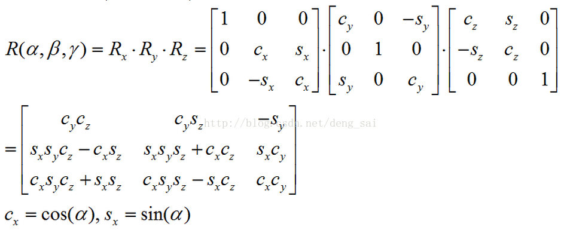
 ### 3. 旋转轴/旋转角度
 用旋转轴的方向向量n和旋转角度θ来表示一个旋转，其中
 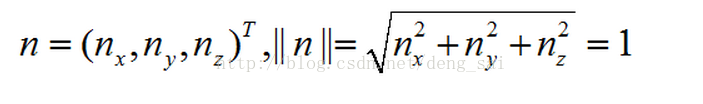
 $\theta > 0$表示逆时针旋转。

#### 3.1 旋转轴/旋转角度转化为旋转矩阵
 设v是任意一个向量，定义
 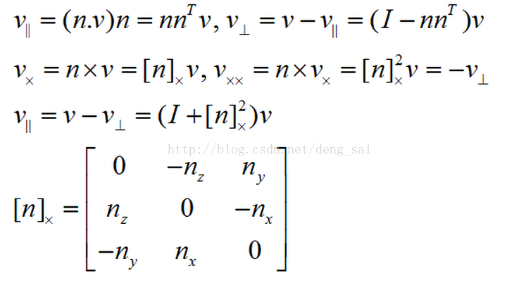

如下图所示

 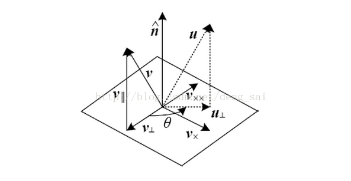

这样，我们建立了一个直角坐标系
 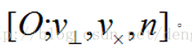

设u为v绕轴旋转后得到的向量，则有

 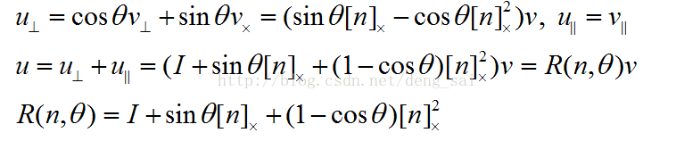
 
R即为旋转矩阵。进一步可表示为

 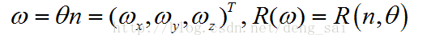

4. 单位四元数(Unit quaternions)
 四元数由Hamilton于1843年提出，实际上是在四维向量集合上定义了通常的向量加法和新的乘法运算，从而形成了一个环。
 
  
 
  
 
 q称为单位四元数，如果||q||=1。一个单位四元数可以表示三维旋转。用单位四元数表示旋转可以保持一个光滑移动的相机的轨迹，适合动画生成。 
 
 4.1 旋转轴/旋转角度 转化为 单位四元数 
 根据旋转轴n和旋转角度θ，得到单位四元数q
    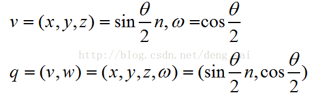
 4.2 单位四元数 转化为 旋转轴/旋转角度 
    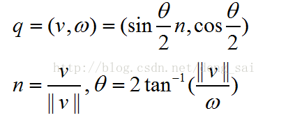
 4.3 单位四元数 转化为 旋转矩阵 
  
   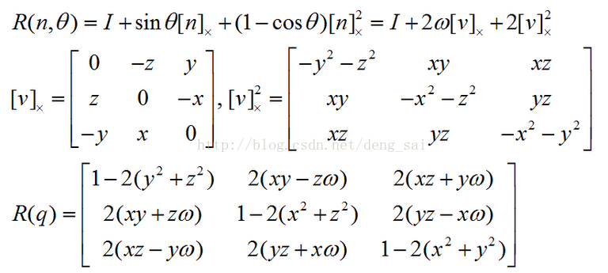
  
 
 
  4.4 四元数的性质 
 定义四元数的逆、乘法和除法，如下所示
 
  
   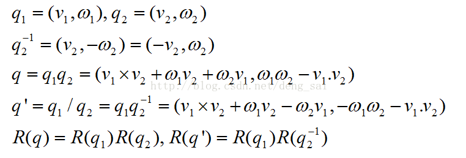
  
 根据该性质，我们可以对两个旋转变换q1和q2作线性插值，这相当于在四维空间中的超球面上对点q1和q2作球面线性插值。 
 
 
  
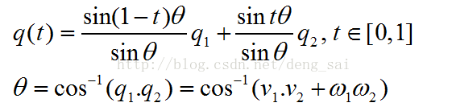
  
 也可以按下面的方法计算 
 
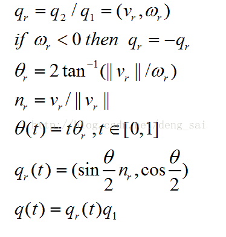

